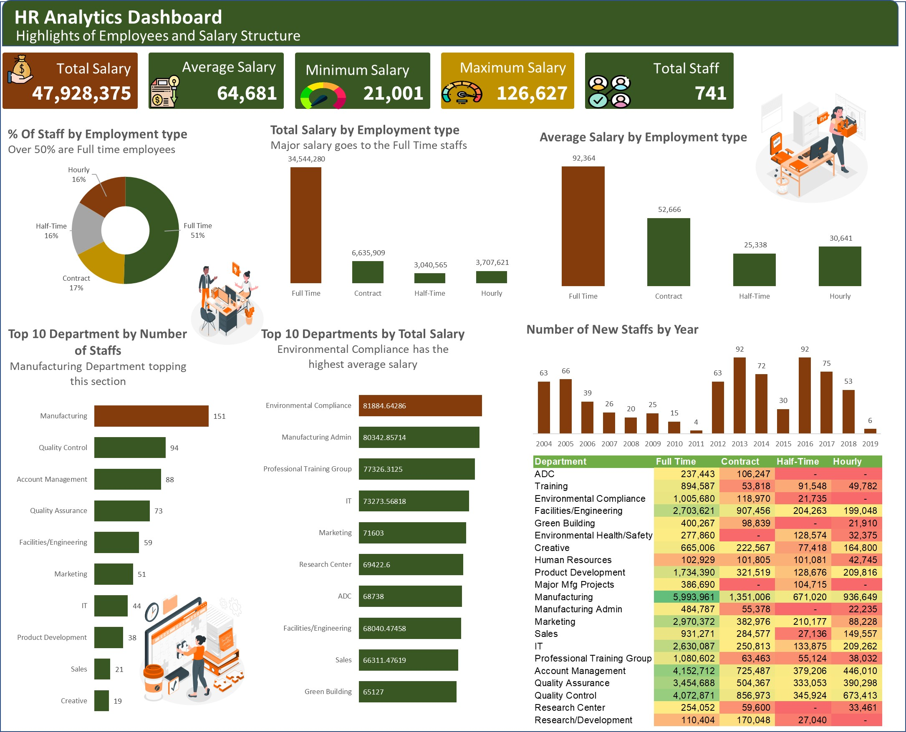

# Project Name:
HR Analytics (Festman)

# Project statement:
 To Show The Highlights of Employees and Salary Structure.
 # Data Sourcing: 
 FESTMAN Learning Hub
 # Findings: 
 
 Manufacturing Department has the highest number of Staffs.
 
 Full Time Employees are Above 50% of the Total staffs.
 
 Largest portion of Salary allocation goes to the Full Time Staffs.
 
 Environmental Compliance has the highest average salary.
